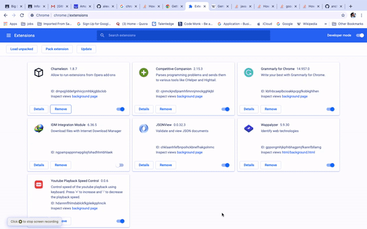

# wikipedia-sematics

This is suppport plugin for the Information Retrieval (CSE508) Academic Project 2020. 

## Usage

---
1. Download Zip and Extract it.
2. Now Go to Chrome Extension. Enable Developer Mode.
3. After that click on Load Unpacked.
4. Choose the Extracted Folder.
5. Go to Wikipedia, then checkout Plugin.

## Contributors:

* Prashant Pathak
* Anchit Gupta
* Deekshant Mamodia

## TODO:

1. ``Add text box for the line``
2. ``Add text box for the citation``
3. ``Show pop up window for the result``
4. ``Fix UI elements``
5. ``Add More Suitable Images``
6. ``Code Cleanup``

### License:

MIT License 2020. All Right Reserved to Repository Contributors.
 
