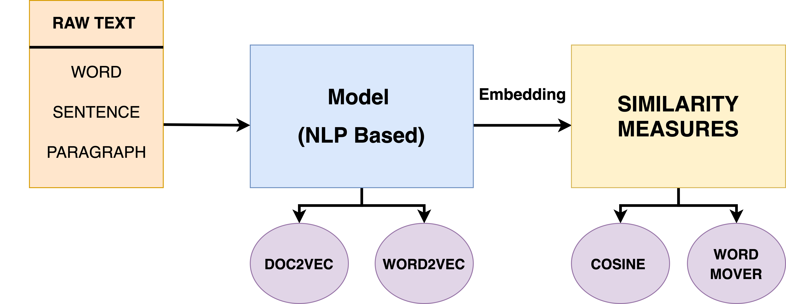

# Extraction Of Similar Semantic Sentence From Wikipedia Citation

This is suppport plugin and the scrapper code for the Information Retrieval (CSE508) Academic Project 2020.  
Text similarity is used to determine how ‘close’ two pieces of text are with respect to their surface closeness (lexical similarity) or with respect to their meaning (semantic similarity). Semantic text similarity is a very challenging problem in IR and NLP field. In this project, we try to get a semantically similar sentence in the cited document to the cited text, in the context of Wikipedia. We have explored two things in the project. First, we explored different embedding that converts text to vector and still holds the semantic meaning like the Word2Vec and Doc2Vec model. Second, we have explored many similarity and distance metric which help to calculate the results effectively. Apart from this, we have also designed an end to end application of the above task. We have developed an API and plugin so that our project becomes user friendly.
## Requirement:

- Internet
- Python3.6+
  - NLTK
  - Genism
  - Numpy
  - Scipy
  - wikipedia2vec
- Chrome Web Browser (Any Channel; Works also on the Chromium)
- RAM: 4GB (Minimum)
- Space Requirement: 10 GB
- Microsoft Build C++ Tools 14.0

## Server Deployment (Local Steps)

---

1. Install all necessary all files and download model from this [link](https://drive.google.com/open?id=1Rew3sxN556vDg7k7yxQwYjC80az44n1x).
2. Go to -> scrapping in the directory and run command ``python api.py`` or ``python3 api.py``.
3. Now server will be live on the ``http://127.0.0.1:5000/``.
4. For sentence based encoding, set the [wantPara](https://github.com/anchitgupt/wikipedia-sematics/blob/8ac204118ddf727d178c1abc16fa91cb6cc5b533/scrapping/model.py#L48) to ``False`` or vice-versa.

## Plugin Usage
<!--  -->

---
1. Download Zip and Extract it.
2. Now Go to Chrome Extension. Enable Developer Mode.
3. After that click on Load Unpacked.
4. Choose the Extracted Folder.
5. Go to any Wikipedia article.
6. Select text which contains the citation which will be your query.
7. Run go to plugin and click on **Submit** button.
8. Now wait for result. Will show for each citation ocuuring in the query document. 

## System Design

### Overall Design

### Backend Flow

# Result

## Contributors:

* [Prashant Pathak](https://github.com/ppthegp)
* [Anchit Gupta](https://github.com/anchitgupt)
* [Deekshant Mamodia](https://github.com/Deekshantiiitd)

<!-- ## TODO:

1. ``Add text box for the line``
2. ``Add text box for the citation``
3. ``Show pop up window for the result``
4. ``Fix UI elements``
5. ``Add More Suitable Images``
6. ``Code Cleanup`` -->

### License:

MIT License

Copyright (c) 2020 Anchit Gupta

Permission is hereby granted, free of charge, to any person obtaining a copy
of this software and associated documentation files (the "Software"), to deal
in the Software without restriction, including without limitation the rights
to use, copy, modify, merge, publish, distribute, sublicense, and/or sell
copies of the Software, and to permit persons to whom the Software is
furnished to do so, subject to the following conditions:

The above copyright notice and this permission notice shall be included in all
copies or substantial portions of the Software.

THE SOFTWARE IS PROVIDED "AS IS", WITHOUT WARRANTY OF ANY KIND, EXPRESS OR
IMPLIED, INCLUDING BUT NOT LIMITED TO THE WARRANTIES OF MERCHANTABILITY,
FITNESS FOR A PARTICULAR PURPOSE AND NONINFRINGEMENT. IN NO EVENT SHALL THE
AUTHORS OR COPYRIGHT HOLDERS BE LIABLE FOR ANY CLAIM, DAMAGES OR OTHER
LIABILITY, WHETHER IN AN ACTION OF CONTRACT, TORT OR OTHERWISE, ARISING FROM,
OUT OF OR IN CONNECTION WITH THE SOFTWARE OR THE USE OR OTHER DEALINGS IN THE
SOFTWARE.

 All Right Reserved to Repository Contributors.
 
