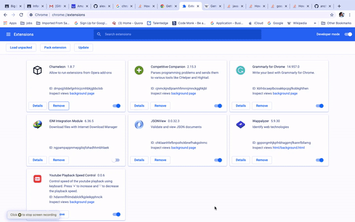

# Extraction Of Similar Semantic Sentence From Wikipedia Citation

This is suppport plugin and the scrapper code for the Information Retrieval (CSE508) Academic Project 2020.

## Requirement:

- Internet
- Python3.6+
  - NLTK
  - Genism
  - Numpy
  - Scipy
  - wikipedia2vec
- Chrome Web Browser (Any Channel; Works also on the Chromium)
- RAM: 4GB (Minimum)
- Space Requirement: 10 GB
- Microsoft Build C++ Tools 14.0

## Server Deployment (Local Steps)

1. Install all necessary all files and download model from this [link](https://drive.google.com/open?id=1Rew3sxN556vDg7k7yxQwYjC80az44n1x).
2. Go to -> scrapping in the directory and run command ``python api.py`` or ``python3 api.py``.
3. Now server will be live on the ``http://127.0.0.1:5000/``.

## Plugin Usage

---
1. Download Zip and Extract it.
2. Now Go to Chrome Extension. Enable Developer Mode.
3. After that click on Load Unpacked.
4. Choose the Extracted Folder.
5. Go to any Wikipedia article.
6. Select text which contains the citation which will be your query.
7. Run go to plugin and click on **Submit** button.
8. Now wait for result. Will show for each citation ocuuring in the query document. 

## System Design

### Overall Design

### Backend Flow

## Contributors:

* Prashant Pathak
* Anchit Gupta
* Deekshant Mamodia

<!-- ## TODO:

1. ``Add text box for the line``
2. ``Add text box for the citation``
3. ``Show pop up window for the result``
4. ``Fix UI elements``
5. ``Add More Suitable Images``
6. ``Code Cleanup`` -->

### License:

MIT License 2020. All Right Reserved to Repository Contributors.
 
